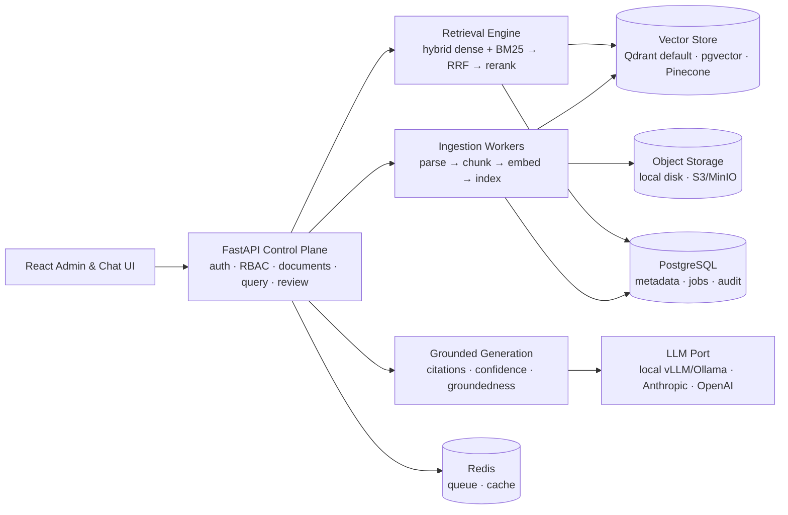

<div align="center">

# Enterprise Knowledge Copilot

**Self-hosted, production-grade agentic RAG.**
Deploy a domain-tuned, citation-faithful answer engine on your own infrastructure — your documents never leave your servers.

[](LICENSE)
[](https://github.com/malakazlan/Enterprise-Knowledge-Copilot/actions/workflows/ci.yml)
[](backend/pyproject.toml)
[](https://fastapi.tiangolo.com)
[](https://docs.astral.sh/ruff/)
[](backend/pyproject.toml)

[Quickstart](#-quickstart) · [Architecture](#-architecture) · [API tour](#-api-tour) · [Domain profiles](#-domain-profiles) · [Status](#-project-status)

</div>

> ⚠️ **Alpha — under active development.** The API is stabilizing; see [Project status](#-project-status) for what works today.

---

## Why

Enterprises sit on tens of thousands of PDFs, contracts, SOPs, and manuals. Employees waste hours searching. Generic chatbots hallucinate answers no compliance team will accept — and SaaS RAG means shipping sensitive documents to someone else's cloud.

**Enterprise Knowledge Copilot** is the alternative you run yourself:

| | |
|---|---|
| 🔒 **Sovereign by default** | Runs fully on your hardware with local models — zero API keys required. Air-gap friendly. |
| ☁️ **Cloud-upgradable** | Flip a config switch to use Anthropic, OpenAI, Cohere, or Pinecone. Every provider sits behind a swappable port. |
| 🎯 **Domain profiles** | Legal, Finance, Healthcare, Government, Manufacturing, Insurance — validated configuration packs that tune chunking, retrieval, and trust thresholds in one click. |
| 📎 **Grounded or nothing** | Answers cite document **and page**, carry a confidence score, and the system refuses or routes to human review instead of guessing. |
| 🔌 **API-first** | Clean REST APIs — use it headless as the RAG backend for your own apps, or with the full admin UI. |
| 🤖 **Agentic setup copilot** *(planned)* | An agent that interviews you, configures the pipeline for your use case, and tunes it against measured quality. |

## 🏗 Architecture



Every stage reads its tuning from the **active profile** — a validated configuration pack — and every external provider implements a **port** with a local default adapter. That is what makes the same codebase work air-gapped in a government agency and cloud-connected in a startup.

## 🚀 Quickstart

Requires Docker + Docker Compose.

```bash
git clone https://github.com/malakazlan/Enterprise-Knowledge-Copilot.git
cd Enterprise-Knowledge-Copilot

make up          # postgres + redis + api
open http://localhost:8000/docs
```

Local development without Docker:

```bash
cd backend
python -m venv .venv && . .venv/bin/activate   # Windows: .venv\Scripts\activate
pip install -e ".[dev]"
cp .env.example .env
uvicorn app.main:app --reload
```

## 🔌 API tour

```bash
BASE=http://localhost:8000/api/v1

# 1. Register and log in
curl -s -X POST $BASE/auth/register -H 'Content-Type: application/json' \
  -d '{"email":"admin@acme.com","password":"a-strong-password"}'
TOKEN=$(curl -s -X POST $BASE/auth/login -H 'Content-Type: application/json' \
  -d '{"email":"admin@acme.com","password":"a-strong-password"}' | jq -r .access_token)

# 2. Upload a document — parsed, chunked, embedded, and indexed
curl -s -X POST $BASE/documents -H "Authorization: Bearer $TOKEN" \
  -F "file=@safety-manual.md"

# 3. Browse the built-in domain profiles
curl -s $BASE/profiles -H "Authorization: Bearer $TOKEN" | jq '.[].name'
```

Interactive OpenAPI docs at [`/docs`](http://localhost:8000/docs). Search (`/search`) and grounded answers (`/query`) are landing in the current milestone.

## 🎯 Domain profiles

A profile is a **validated configuration pack** — chunking granularity, hybrid-retrieval weights, reranking, temperature, citation strictness, and human-review/refusal thresholds tuned for an industry's risk posture. Ships with seven:

| Profile | Tuned for | Trust posture |
|---|---|---|
| `general` | Mixed corporate knowledge bases | Balanced |
| `legal` | Contracts, case law, compliance | Temp 0 · clause-level chunks · strict refusal |
| `finance` | Filings, reports, IFRS/GAAP | Temp 0 · exact-match weighted (tickers, codes) |
| `healthcare` | Clinical guidelines, protocols | **Most conservative** — refuses readily, reviews often |
| `government` | Regulations, public records | Local-only providers (air-gap) · audit-grade citations |
| `manufacturing` | Equipment manuals, SOPs | Procedure-step chunks · part-number matching |
| `insurance` | Policy wordings, claims manuals | Clause-level · exclusion-aware retrieval |

Selecting one requires no RAG expertise — the pack encodes it.

## 📊 Project status

| Milestone | State |
|---|---|
| Core platform — JWT auth + RBAC, structured logging, error envelope, Prometheus metrics, Docker, CI | ✅ |
| Ingestion pipeline — parse → chunk → embed → index, Celery workers, document APIs | ✅ |
| Domain profiles — strict schema, 7 packs, profiles API | ✅ |
| Hybrid retrieval — BM25 + dense, RRF fusion, reranking, `/search` | 🔨 in progress |
| Grounded generation — `/query` with citations, confidence, groundedness checks | ⏳ next |
| Provider adapters — Docling, LlamaParse, OCR, Qdrant, Pinecone, Anthropic, OpenAI, Cohere | ⏳ |
| Evaluation harness — golden sets, retrieval & faithfulness metrics | ⏳ |
| Human review queue, admin dashboard, React UI | ⏳ |
| Agentic setup copilot (MCP) | ⏳ |

## 🧰 Tech stack

**Backend** Python · FastAPI · Pydantic v2 · SQLAlchemy 2.0 (async) · Alembic · Celery
**Data** PostgreSQL · Redis · Qdrant (default) / pgvector / Pinecone
**AI** Provider-abstracted parsers, embedders, rerankers, and LLMs — local-first, cloud-optional
**Frontend** React 18 · TypeScript · Vite · Tailwind CSS
**Quality** ruff · mypy (strict) · pytest · GitHub Actions

## 🛠 Development

```bash
cd backend
ruff check app tests && ruff format --check app tests   # lint + format
mypy app                                                # strict type-check
pytest                                                  # self-contained suite (no services needed)
```

The test suite runs against in-memory SQLite and temp-dir storage — no external services, no API keys.

## 🤝 Contributing

Issues and pull requests are welcome. Keep commits atomic with one-line conventional messages, and make sure the full quality gate above is green.

## 📄 License

[Apache-2.0](LICENSE)
