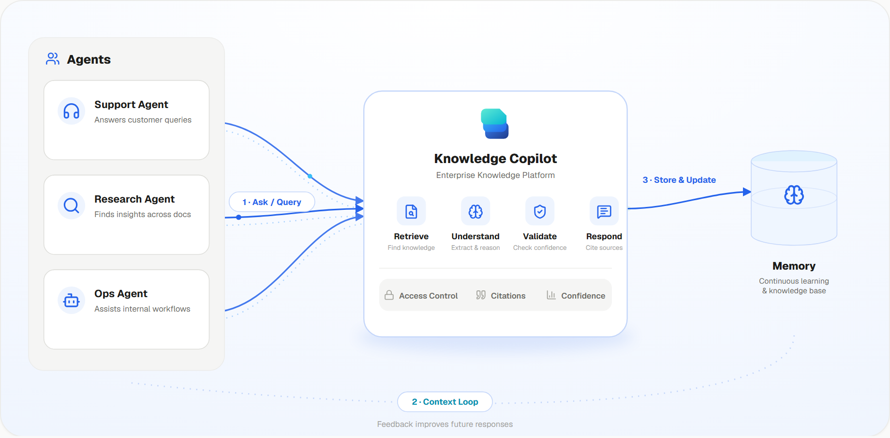
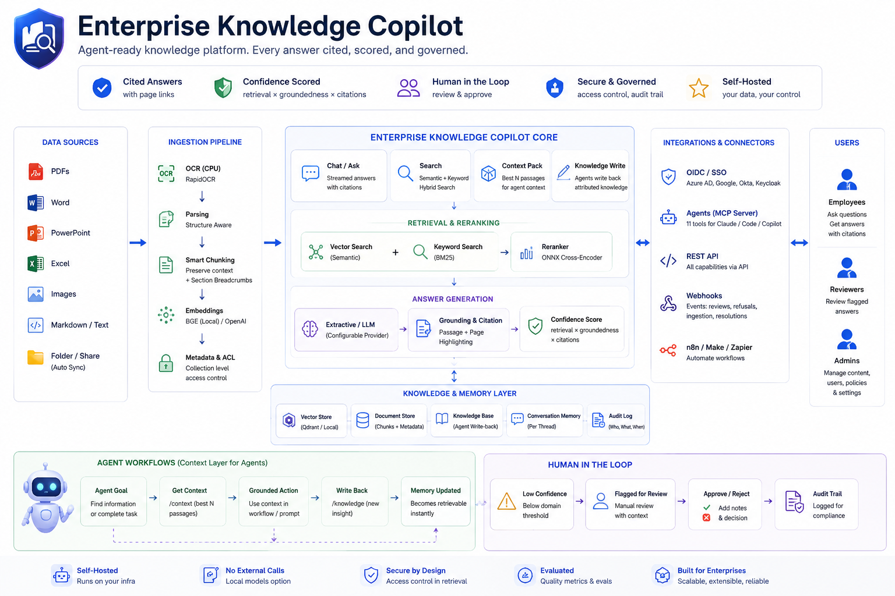

<div align="center">

# Enterprise Knowledge Copilot

**Open-source, self-hosted, agent-ready knowledge platform — every answer cited, scored, and governed.**

[](LICENSE)
[](https://github.com/malakazlan/Enterprise-Knowledge-Copilot/actions/workflows/ci.yml)
[](backend/pyproject.toml)
[](frontend/package.json)



</div>

Enterprises sit on thousands of PDFs, contracts, SOPs, and manuals — and employees waste hours searching them. Generic chatbots hallucinate answers no compliance team will accept, and SaaS RAG means shipping sensitive documents to someone else's cloud.

**Enterprise Knowledge Copilot** is the alternative you run yourself: a complete retrieval-augmented answering platform where every answer cites the exact document and page, carries a confidence score, and — when the evidence isn't there — **declines instead of guessing**. Humans review what the system isn't sure about. Agents consume it as tools. Nothing leaves your servers.

## What it does

**Ask, with receipts.** Streamed chat answers with inline `[1]` citations that jump to the highlighted passage in the source document. Persistent conversation threads. A composite confidence score (retrieval × groundedness × citations) on every answer.

**Refuse, on the record.** Below a per-domain confidence threshold, the system flags the answer for human review or refuses outright — and every refusal is logged with its reason. Reviewers approve or reject flagged answers with notes; the audit trail records who asked, what was answered, from which page, and who signed off.

**Ingest what enterprises actually have.** PDFs (with automatic CPU OCR for scans), Word / PowerPoint / Excel, images, Markdown, text. Structure-aware chunking keeps paragraphs intact and stamps every chunk with its section breadcrumb. **Click-to-connect sources** from a connector gallery: **Google Drive** and **Notion** via one-click OAuth, **Confluence** via an API token, plus a **server folder** for mounted shares and drop directories. Every sync is checksum-deduplicated and idempotent — schedule it and the corpus stays current.

**Control who sees what.** Collections put an access boundary around documents, enforced *inside* the retrieval pipeline (both search channels), not filtered after the fact. Membership is managed in the UI; revocation takes effect on the next query.

**Be the context layer for your agents.** Agentic workflows don't just ask questions — they consume and maintain context:
- **OpenAI-compatible endpoint** — point any OpenAI-SDK client at `/v1/chat/completions` (the `model` is a domain profile). Answers come back grounded and cited, with trust signals (`answered`, `confidence`, `citations`, `needs_review`) in an `ekc` extension your workflow can branch on
- **Context packs** — `POST /context` returns the best N tokens of ranked, deduplicated passages with `[Source: file, p.N]` provenance, ready to inject into any agent's prompt; access control applies at retrieval
- **Agent memory** — scoped, expiring semantic memory (`remember` / `recall`): each agent keeps facts, episodes, and preferences private to its own scope and recalls them across turns, so context survives the whole task
- **Knowledge write-back** — agents deposit what they learn (`POST /knowledge`): small attributed entries that become retrievable with citations within seconds, governed like every other document. Entries carry `verify_by` dates; past-due knowledge surfaces as *stale*, so context rot is visible and assignable
- **MCP server** (`ekc-mcp`) — Claude Desktop/Code or any MCP client gets 13+ tools (`ask`, `search`, `get_context`, `write_knowledge`, `remember`, `recall`, evals, admin) plus a `setup-copilot` prompt that configures the deployment conversationally
- **REST API** — headless usage with role-scoped API keys (`ekc_…`), batch endpoint for pipeline workloads, SSE streaming
- **Webhooks** — HMAC-signed pushes on refusals, review flags, resolutions, and ingestion events, with retry + backoff

**Prove it doesn't hallucinate.** [**Trust Bench**](bench/) is a reproducible, versioned benchmark that asks the question marketing never does: *when the answer isn't in the corpus, does the system refuse or guess?* A synthetic corpus with 20 answerable questions and 15 deliberate **trap questions** (including premise-injection traps) scores grounded-answer rate, citation accuracy, and **false-answer rate**. Run `python bench/run.py` against any deployment. Latest run: **100% grounded, 100% citation accuracy, 0% false answers.** A separate evaluation harness (hit rate, MRR, page accuracy, keyword recall) compares domain profiles A/B before you trust a change.

**Sign in your way.** Email/password (first account becomes admin) or OIDC single sign-on — Microsoft Entra, Google Workspace, Okta, Keycloak — enabled by four environment variables. Rate limiting guards auth (per IP) and query endpoints (per principal).

## Runs fully local — cloud optional

Every provider is a configuration choice behind the same port:

| Layer | Local (zero API keys) | Cloud / self-hosted |
|---|---|---|
| Embeddings | BGE via ONNX on CPU (`fastembed`) | OpenAI |
| Reranking | ONNX cross-encoder | (lexical fallback) |
| Answering | Extractive (conservative, no LLM) | OpenAI, Anthropic, Ollama, vLLM |
| Vector store | In-memory | Qdrant |
| OCR | RapidOCR (CPU) | GPU adapters planned |

The fully-local tier does real semantic search with no external calls after a one-time model download — air-gapped deployments work.

## Quickstart

```bash
git clone https://github.com/malakazlan/Enterprise-Knowledge-Copilot.git
cd Enterprise-Knowledge-Copilot
cp backend/.env.example backend/.env   # optional — defaults run fully local
docker compose -f infra/docker-compose.yml up -d
```

Open **http://localhost:8000** — the first account you register is the administrator. Upload a document, ask a question, click the citation.

The image bundles the web app, API, migrations, OCR, and Office parsing. Interactive API reference at `/docs`; a zero-build fallback console at `/console`.

### Local development

```bash
# backend
cd backend
python -m venv .venv && .venv/Scripts/activate   # POSIX: source .venv/bin/activate
pip install -e ".[dev,ocr,office,local,mcp]"
uvicorn app.main:app --reload

# frontend (dev server; production is a static export served by the API)
cd frontend
npm ci && npm run dev
```

Quality gates: `ruff check`, `ruff format --check`, `mypy` (strict), `pytest` (210+ hermetic tests — no network, no external services).

## Configuration essentials

Everything is environment-driven (see `backend/.env.example`):

```bash
# Providers
LLM_PROVIDER=extractive|openai|anthropic|ollama
EMBEDDER_PROVIDER=fastembed|openai|hashing
RERANKER_PROVIDER=onnx|lexical
VECTOR_STORE_PROVIDER=qdrant|memory
OCR_PROVIDER=rapidocr|none

# Domain behaviour (thresholds, chunking, top-k) — 7 built-in profiles:
# legal, finance, healthcare, government, manufacturing, insurance, general

# OIDC SSO (optional)
OIDC_ISSUER=https://accounts.google.com
OIDC_CLIENT_ID=...
OIDC_CLIENT_SECRET=...
OIDC_REDIRECT_URL=https://your-host/api/v1/auth/oidc/callback

# Click-to-connect connectors (optional): Google Drive & Notion OAuth
PUBLIC_BASE_URL=https://your-host
GDRIVE_CLIENT_ID=...       GDRIVE_CLIENT_SECRET=...
NOTION_CLIENT_ID=...       NOTION_CLIENT_SECRET=...
# Confluence & server folders need no env vars — configured in the UI.
```

## Connect an agent

**Any OpenAI-SDK client** — change one line:

```python
from openai import OpenAI

client = OpenAI(base_url="https://kb.your-company.internal/v1", api_key="ekc_...")
resp = client.chat.completions.create(
    model="legal",                                   # a domain profile
    messages=[{"role": "user", "content": "..."}],
)
# resp.ekc -> { answered, confidence, citations, needs_review }
```

**Claude Desktop / Claude Code (MCP)**:

```jsonc
{
  "command": "ekc-mcp",
  "env": { "EKC_URL": "https://kb.your-company.internal", "EKC_API_KEY": "ekc_..." }
}
```

Either way, agents get grounded, cited answers with machine-readable trust signals — `answered: false` means the corpus lacks evidence, so workflows can branch to a human instead of acting on a guess.

## Security posture

- Passwords hashed; JWT sessions with refresh rotation; API keys stored as SHA-256 hashes, shown once
- Role-based access (admin / reviewer / user) on every endpoint; document ACLs enforced at retrieval time
- Frontend ships as a static export served by the API — no Node.js process in production, CSP blocks all external origins, `npm audit` clean
- Rate limiting on auth and query; OIDC tokens validated against provider JWKS with nonce binding
- Webhook deliveries HMAC-SHA256 signed

## Architecture



## License

[Apache-2.0](LICENSE)
